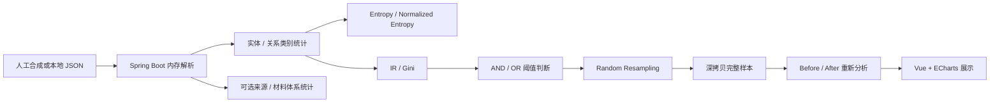

# 文本数据医院——数据均衡性治理模块（公开展示版）

这是多人协作“文本数据医院”项目中，我负责的数据均衡性治理模块的独立公开展示版本。原项目为 Private 仓库，因此本仓库只整理本人负责的核心思路与代码，并重新实现了最小前端、内存数据接入和公开 API；它不是原完整系统的镜像。

项目面向 Java 后端实习/校招展示，重点说明如何对文本标注数据进行类别分布统计、均衡性量化、阈值判断和可复现的 Random Resampling 治理。

> License information will be added after ownership and redistribution terms are confirmed.

## 我的职责

- 实体类型、关系类型的频数统计
- Shannon Entropy 与 Normalized Entropy 计算
- Imbalance Ratio（IR）与 Gini 计算
- AND / OR 阈值组合策略
- 来源与材料体系的可选分布诊断
- Random Resampling、深拷贝、唯一 ID 与 randomSeed 可复现性
- 关键边界条件和 API 的自动化测试

公开版的页面、数据接入方式和接口层均为独立重构，不包含原项目其他成员负责的页面或业务模块。

## 为什么建立独立公开版

原系统还包含用户、数据挂号、追溯、完整性、准确性和冗余性等多人协作模块，并依赖数据库及内部运行数据。为避免暴露私有代码、配置和数据，本项目主动删除这些依赖，改为接收人工合成 JSON 并全程在内存中处理。

## 技术栈

- 后端：Java 17、Spring Boot 3.5、Maven、Jackson、JUnit 5、MockMvc
- 前端：Vue 3、Vite、ECharts、原生 Fetch API
- 数据：人工合成 JSON；无 MySQL、JPA、MyBatis、Python 或模型依赖

## 功能列表

- 加载均衡/不均衡人工示例
- 粘贴 JSON 或读取本地 JSON 文件
- 实体和关系类别统计
- Entropy、Normalized Entropy、IR、Gini 展示
- IR/Gini 阈值及 AND/OR 策略配置
- ECharts 类别分布图
- 可选来源、材料体系分布检查
- 可指定目标类型、目标次数和 randomSeed 的随机重采样
- 治理前后指标与类别数量对比
- 浏览器端下载治理后 JSON

## 系统流程



所有请求均为无状态内存处理。后端不写入数据集文件，也不返回数据库 ID 或服务器路径。

## 数据格式

接口接受 JSON 对象或对象数组。推荐使用数组：

```json
[
  {
    "id": "sample-01",
    "text": "Synthetic sample.",
    "ner": [[0, 4, "text", "ENTITY_TYPE"]],
    "relations": [[0, 4, 8, 12, "RELATION_TYPE"]],
    "source": "optional-source",
    "materialSystem": "optional-system"
  }
]
```

- `ner`：每个元组第 4 项（索引 3）是实体类型。
- `relations`：每个元组第 5 项（索引 4）是关系类型。
- `source`：可选；也支持 `sourcePdf`、`source_pdf`、`literatureSourceId`、`literature_source_id`。
- `materialSystem`：可选；也支持 `material_system`。
- 可选分布只有在每条样本都有一致、有效的映射时才计算，程序不会猜测缺失归属。

仓库内的 [均衡示例](examples/synthetic-balanced.json)、[不均衡示例](examples/synthetic-imbalanced.json) 和 [治理请求示例](examples/governance-request.json) 均为从零编写的虚构数据，不包含论文文本、用户数据或原项目数据。

## 指标说明

设正频类别数量为 `K`，第 `i` 类的频率为 `pᵢ`。

### Shannon Entropy

```text
H(X) = -Σ pᵢ log₂(pᵢ)
```

熵越高表示类别频率越分散，但它会受到类别数量影响。

### Normalized Entropy

```text
H_norm = H(X) / log₂(K)
```

取值位于 `[0, 1]`。只有一个正频类别时没有可比较的分布，返回 `N/A`。公开版把它作为分布参考，不单独作为显著不均衡结论。

### Imbalance Ratio

```text
IR = max(category count) / min(positive category count)
```

IR 直接描述最多类别与最少正频类别之间的倍数差异。

### Gini

类别计数按升序排列后计算 Gini。`0` 表示完全均等，数值越大表示频数越集中。

### AND / OR 阈值策略

- `AND`：IR 和 Gini 都达到阈值时，判断为显著不均衡。
- `OR`：任一指标达到阈值时，判断为显著不均衡。

默认阈值为 `IR ≥ 10`、`Gini ≥ 0.4`、策略 `AND`，可在页面或 API 参数中调整。这些阈值用于演示，不代表对所有数据集都适用。

## Random Resampling 治理机制

1. 从实体或关系分布中选择一个已有目标类型。
2. 找出所有包含该目标类型的完整样本。
3. 使用 `java.util.Random(randomSeed)` 选择候选样本。
4. 深拷贝整个样本，保留其标注上下文。
5. 为副本生成确定且不冲突的新 ID。
6. 达到目标次数后重新计算全部指标。

同一份 JSON、治理对象、目标类型、目标次数和 randomSeed 会得到相同的抽样序列及副本 ID，便于复现实验。若不提供 randomSeed，后端生成一个非负 JavaScript 安全整数，并在响应中返回。

一条样本可能包含多个相同目标标注，因此复制一次可能跨过目标次数，响应中的 `overshoot` 会明确记录超出量。

Random Resampling 只增加已有样本副本，不会产生新的真实证据，也不保证所有指标一定改善。

## API

### `POST /api/balance/analyze`

请求体为数据集 JSON。可选查询参数：

- `imbalanceRatioThreshold`
- `giniThreshold`
- `thresholdMode=AND|OR`

响应包含样本数、实体/关系指标、类别升序列表，以及可选来源/材料体系分布。

### `POST /api/balance/govern`

```json
{
  "dataset": [{"id": "s1", "ner": [[0, 1, "x", "RARE"]], "relations": []}],
  "targetKind": "ENTITY",
  "targetType": "RARE",
  "targetCount": 4,
  "randomSeed": 42,
  "imbalanceRatioThreshold": 10,
  "giniThreshold": 0.4,
  "thresholdMode": "AND"
}
```

响应直接包含治理后 JSON、Before/After 完整分析、实际目标次数、复制样本数、overshoot 和 randomSeed。

### `GET /api/examples/{name}`

`name` 可为 `balanced` 或 `imbalanced`，返回仓库中的人工合成示例。

## 项目结构

```text
Text-Hospital-Balance-Public/
├─ backend/
│  ├─ pom.xml
│  └─ src/
│     ├─ main/java/.../balance/
│     │  ├─ controller/
│     │  ├─ dto/
│     │  ├─ governance/
│     │  ├─ metric/
│     │  └─ service/
│     ├─ main/resources/application.yml
│     └─ test/java/.../balance/
├─ frontend/
│  ├─ package.json
│  ├─ vite.config.js
│  └─ src/
│     ├─ components/
│     └─ services/
├─ examples/
├─ docs/screenshots/
├─ .gitignore
└─ README.md
```

## 本地运行

环境要求：

- JDK 17
- Maven 3.9+
- Node.js `^20.19.0` 或 `>=22.12.0`

启动后端：

```bash
cd backend
mvn spring-boot:run
```

后端监听 `http://localhost:8080`。

启动前端：

```bash
cd frontend
npm install
npm run dev
```

前端监听 `http://localhost:5173`。Vite 仅将单一 `/api` 前缀代理到后端，不存在 `/api/api` 重复拼接。

生产构建：

```bash
cd frontend
npm run build
```

## 单元测试

```bash
cd backend
mvn test
```

测试覆盖：

- Shannon / Normalized Entropy
- IR 与 Gini
- AND / OR 阈值策略
- 来源与材料体系纯计算
- 随机重采样与关系目标
- randomSeed 可复现性
- 深拷贝与唯一 ID
- overshoot 与无需治理分支
- 非法输入
- 分析、治理和示例 API

## 页面截图

截图将在人工确认公开内容和许可证后放入 `docs/screenshots/`。建议展示数据输入、诊断图表和 Before/After 三个区域。

## 已知限制

- 为求职演示设计，未实现账号、权限、数据库或任务队列。
- 请求在内存中同步处理，不适合超大数据集。
- 当前只识别约定的 NER 和关系元组位置。
- 重采样复制完整样本，可能产生 overshoot。
- 重采样不能替代真实数据采集与标注。
- 阈值需要根据具体业务和数据规模校准。

## 隐私与安全

- 只包含人工合成示例，不包含真实论文、用户或业务数据。
- 不包含密码、Token、API Key、私钥、数据库地址或开发者机器路径。
- 后端不持久化请求数据，不返回服务器文件路径。
- 浏览器下载由前端根据 API 响应生成，不创建服务器文件。
- `target/`、`node_modules/`、`dist/`、本地配置和常见密钥文件均由 `.gitignore` 排除。

## 项目来源及个人贡献

本仓库来源于多人协作的 Private 项目“文本数据医院”。公开版只整理 Git 作者身份 `Ryugu-RenaChopper` 负责的均衡性计算与随机重采样思路；原项目中由其他成员编写或共同修改的 Controller、页面、数据挂号、追溯、数据库配置等代码均未直接复制，所需接口和页面已重新实现。

本仓库暂不附带 LICENSE。待代码归属和再分发条款完成确认后，再补充许可证信息。
